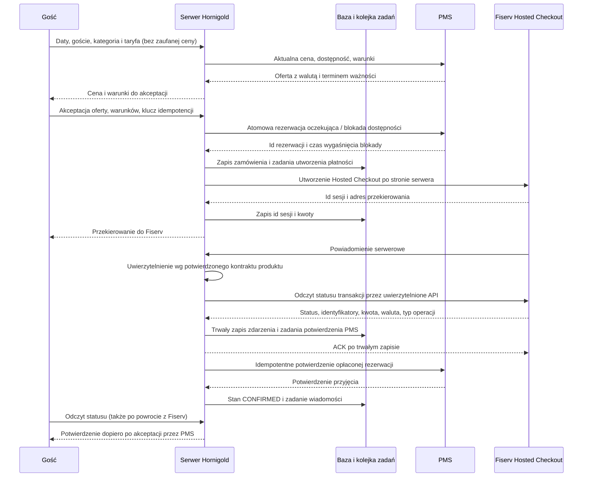

# Hornigold — własna rezerwacja, PMS i Fiserv

Stan 2026-10-06: **projekt integracji, nie działający system płatności**. Nie utworzono rezerwacji, sesji Fiserv ani obciążenia. Repozytorium zawiera statyczny serwis; poniższy kontrakt należy zaimplementować na serwerze po potwierdzeniu dostępnego API. Widoczne usunięcie etykiety testowej nie odblokowuje integracji.

## Przepływ zatwierdzony do przygotowania

## Kontrakt bezpieczeństwa i spójności

1. Cena pochodzi wyłącznie z PMS. Kwoty przechowywać jako liczby całkowite najmniejszych jednostek waluty; regułę konwersji określić dla każdej obsługiwanej waluty. Zmiana ceny wymaga ponownej akceptacji gościa.
2. Dostępność i utworzenie blokady muszą być atomowe w PMS. Samo wcześniejsze sprawdzenie dostępności nie zapobiega sprzedaży ostatniego pokoju dwóm gościom. Bez mechanizmu blokady/warunkowego zapisu nie uruchamiać sprzedaży.
3. Idempotencja dla tworzenia zamówienia, rezerwacji PMS, sesji płatności, webhooków, potwierdzeń i wiadomości. Ten sam klucz z innymi danymi: konflikt. Timeout po wysłaniu żądania oznacza stan nieznany i wymaga odczytu/reconciliation, a nie ponownego utworzenia.
4. Unikalne powiązanie: zamówienie Hornigold ↔ obiekt PMS ↔ rezerwacja PMS ↔ konto/store Fiserv ↔ checkout ↔ transakcja. Sprawdzić wszystkie identyfikatory, kwotę, walutę i typ operacji. Autoryzacja, zwrot i anulowanie nie są płatnością SALE/capture.
5. Webhook: ograniczony rozmiar, właściwy Content-Type, podpis według dokumentacji **tego produktu i konta**, surowe bajty lub kanoniczne pola zgodnie z kontraktem, porównanie w stałym czasie, ochrona przed powtórzeniami i rotacja klucza. Nie wymyślać nazwy nagłówka ani algorytmu. Brak ustalonego uwierzytelnienia blokuje uruchomienie. Nie przenosić algorytmu z Fiserv IPG Connect/Managed PFAC do Checkout API.
6. Odczyt płatności przez serwerowy interfejs Fiserv stanowi dodatkową kontrolę, szczególnie gdy powiadomienie nie obejmuje podpisem wszystkich danych. Nie ufać JSON otrzymanemu z przeglądarki, parametrowi `success`, zrzutowi ekranu ani samemu przekierowaniu.
7. Trwała baza (docelowo PostgreSQL), transakcje, blokada wiersza zamówienia, tabela deduplikacji zdarzeń, outbox z unikalnymi kluczami, worker i backoff. Potwierdzenie webhooka dopiero po zapisie; nie blokować jego obsługi na dostępności PMS.
8. Dane kart pozostają w Hosted Checkout. Klucze tylko w menedżerze sekretów hostingu, nigdy w repozytorium lub JavaScript. Nie logować całego webhooka (może zawierać dane płatnika/tokeny). Osobne sandbox/live oraz uprawnienia minimalne.
9. Sesja gościa: Secure/HttpOnly/SameSite cookies, CSRF i kontrola Origin dla operacji tworzących rezerwację, limity żądań, walidacja po stronie serwera. Losowy identyfikator nie zastępuje autoryzacji odczytu danych rezerwacji. Status dostępny wyłącznie właścicielowi sesji; bez danych osobowych w URL.
10. Dozwolone adresy przekierowania z konfiguracji serwera. Host sesji Fiserv musi należeć do zatwierdzonej listy dla konkretnego konta/środowiska. Brak dowolnego return URL od klienta.

## Stany i obsługa wyjątków

| Stan / zdarzenie | Działanie | Co widzi gość |
|---|---|---|
| QUOTED | Oferta z czasem ważności; jeszcze bez płatności | Cena i warunki |
| PMS_PENDING | PMS potwierdził blokadę; trwa tworzenie sesji | Przygotowanie płatności |
| PAYMENT_PENDING | Zapisana sesja i ważna blokada | Przejście do Fiserv |
| PAID_PMS_PENDING | Zweryfikowana płatność, PMS jeszcze nie odpowiedział | Płatność otrzymana, potwierdzenie pobytu w toku |
| CONFIRMED | PMS przyjął potwierdzenie | Potwierdzenie pobytu i wiadomość |
| PAYMENT_FAILED / CANCELLED | Anuluj checkout/blokadę wg kontraktów; nie potwierdzaj pobytu | Możliwość ponownego zapytania |
| EXPIRED | Zweryfikuj ostateczny status płatności i unieważnij checkout przed zwolnieniem blokady | Termin płatności minął |
| Płatność po wygaśnięciu blokady | Wstrzymaj automatyczne potwierdzenie; sprawdź dostępność i przekaż operatorowi; ewentualny zwrot wg zatwierdzonej procedury | Płatność wymaga wyjaśnienia |
| PMS nie odpowiada po płatności | Ponawiaj idempotentnie, alert do obsługi; nie pokazuj sukcesu rezerwacji | Potwierdzenie w toku |
| Timeout tworzenia checkout/PMS | Ustal wynik przez lookup po kluczu; nie twórz duplikatu | Weryfikacja operacji |
| Duplikat lub starszy webhook | Deduplikacja; nie cofać stanu końcowego | Bez zmiany |
| Zwrot / chargeback | Oddzielny stan finansowy i zadanie obsługi; nie rezerwować ponownie | Zgodnie z procedurą obsługi |

Nie wolno zgubić opłaconej rezerwacji po awarii procesu. Worker musi odtworzyć outbox po restarcie. Osobny harmonogram sprawdza stany oczekujące także bez webhooka. Harmonogram i timeouty należy dostosować do umowy blokad PMS i sesji Fiserv.

## Plan API Hornigold — nie są to aktywne endpointy

- `POST /api/quotes` — walidacja pobytu, oferta PMS i warunki; bez ceny z przeglądarki.
- `POST /api/reservations` — zaakceptowana aktualna oferta, wersja regulaminu i idempotency key; blokada PMS oraz checkout.
- `POST /api/payments/fiserv/webhook` — wyłącznie powiadomienia dostawcy zgodne z uzgodnionym kontraktem.
- `GET /api/reservations/{id}/status` — autoryzowany odczyt dla gościa; `confirmed` dopiero po PMS.
- Osobny worker — tworzenie/odtwarzanie operacji, potwierdzenia, wygaszenia, wiadomości, reconciliation.
- Zwroty i anulowanie — panel operatora z rolami i audytem; nie publiczny przycisk bez sprawdzenia warunków.

## Dane wymagane od dostawców

**PMS / KWHotel:** dokładny produkt i wersja przypisana do obiektu, umowa API i dokumentacja, sandbox, id obiektu, mapowanie kategorii/taryf/obłożenia, podatki i waluty, operacje atomowej blokady, TTL, potwierdzenie, anulowanie, lookup po naszym id, idempotencja i limity. Ustalić, czy channel manager pozostaje aktywny i która usługa jest źródłem dostępności. Istniejący iframe nie dowodzi uprawnień API.

**Fiserv:** dokładny produkt, region i umowa akceptanta; sandbox/store; dokumentacja tworzenia sesji i odczytu; oficjalny kontrakt autentyczności webhooka wraz z wektorami testowymi; możliwe SALE/capture/preauth, 3DS i BLIK jeśli objęty umową; ważność sesji, duplikaty, retry, lookup, zwroty; lista dozwolonych redirect hosts; limity i certyfikacja. Sama nazwa Hosted Checkout nie identyfikuje API.

**Właściciel / Beata:** wysokość płatności (całość/zaliczka), zasady rezygnacji/no-show/zwrotu, terminy opłacenia, zaakceptowane dokumenty i siedem wersji komunikatów, nadawca maili, procedura awarii i obsługi zwrotów.

**Hosting / Marek:** dostęp do projektu, trwała baza, worker, HTTPS, sekrety, backup/odtworzenie, logi bez danych wrażliwych, alarmy i odpowiedzialność za utrzymanie. API nie działa w GitHub Pages ani na samym hostingu statycznym.

## Warunki odbioru sandbox — obecnie wszystkie NIEWYKONANE

Cena zmieniona; ostatni pokój i równoległe żądania; ten sam klucz wielokrotnie; timeout po zapisie PMS; timeout po utworzeniu checkout; odmowa/3DS failure; prawidłowa płatność; sfałszowany i brakujący podpis; zmieniona kwota/waluta/store/order; duplikat webhooka; webhook przed powrotem; powrót przed webhookiem; zamknięta przeglądarka; restart po płatności; awaria PMS po zapłacie; wygaśnięcie i późna płatność; autoryzacja zamiast capture; zwrot/częściowy zwrot; ograniczenia i potwierdzenia w każdym z siedmiu języków. Każdy wynik powiązać z id sandbox, wersją adaptera i dowodem odbioru PMS/maili. Bez realnych danych gości i obciążeń.

## Źródła sprawdzone 2026-10-06

- [Fiserv Checkout — Introduction](https://docs.fiserv.dev/public/docs/introduction-checkout): sesja, przekierowanie i identyfikator checkout.
- [Fiserv Checkout — Webhooks and status updates](https://docs.fiserv.dev/public/docs/webhooks-and-status-updates-checkout): powiadomienia JSON i dodatkowy odczyt statusu. Ta strona nie dokumentuje wystarczającego kontraktu podpisu dla wdrożenia Hornigold — wymaga potwierdzenia od dostawcy.
- [Fiserv — Message Signature](https://docs.fiserv.dev/public/docs/payments-generate-a-hash): podpisy żądań do API; nie należy traktować ich automatycznie jako podpisów webhooków.
- [GitHub Pages limits](https://docs.github.com/en/pages/getting-started-with-github-pages/github-pages-limits): Pages nie jest docelowym hostingiem sprzedaży online.
